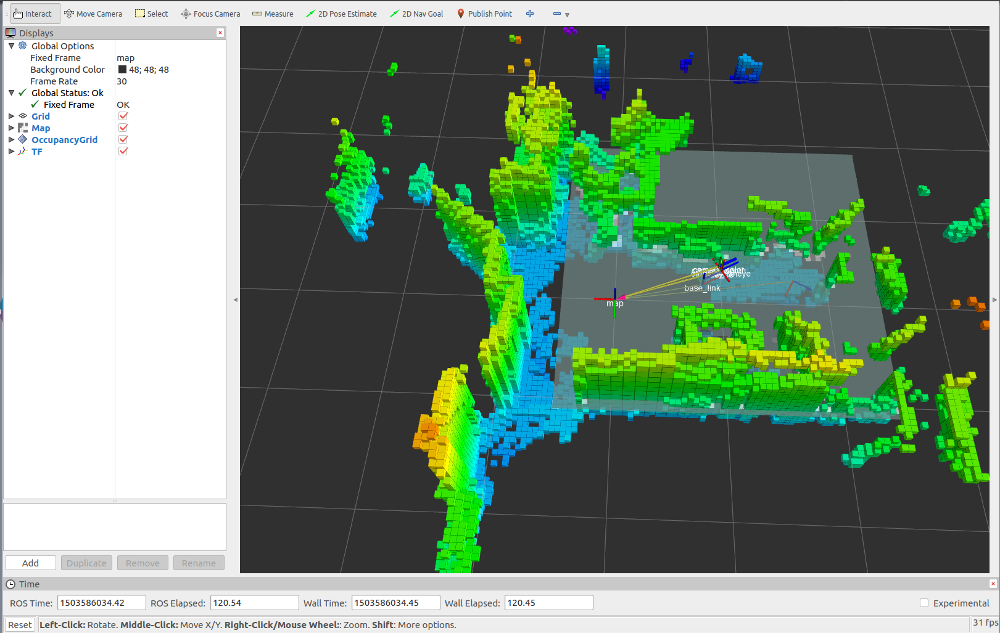
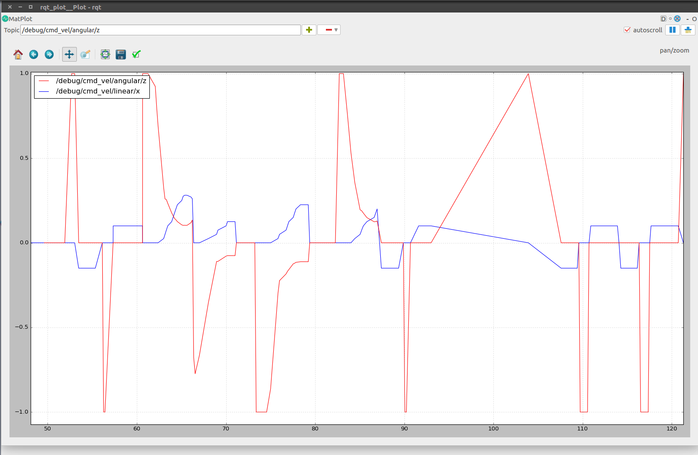

# Cellbots debug visualization with ROS.

## Installation
You need to install ROS Kinetic Kame. Octomap visualization on RViz does not work correctly on ROS Lunar Loggerhead.

## Launch debugging visualizations

Open the terminal and type:

```bash
$ cd tools/rviz/scripts/
```

### Manually launching

With this method would be easier if you open two terminal windows with the following instructions.

```bash
$ export ROS_MASTER_URI=http://$ROBOT_IP:11311
$ export ROS_HOSTNAME=$CURRENT_IP
```

Replace the `ROBOT_IP` and `CURRENT_IP` variables with the robot IP address and your machine IP address respectively.

Then, run one command on each window.

```
$ rviz -d ../config/config.rviz
$ rqt_plot
```

### Bash script launching

```bash
$ source launch_cellbots.sh $ROBOT_IP $CURRENT_IP
```

And replace the variables `ROBOT_IP` and `CURRENT_IP` with the same parameters mentioned before.

#### Example

```bash
$ source launch_cellbots.sh 1.2.3.4   5.6.7.8
```

## Issues

This script cannot be executed inside a launchfile because there is an [open issue](https://github.com/rosjava/rosjava_core/issues/84) with the [rosjava package](https://github.com/rosjava/rosjava_core).



