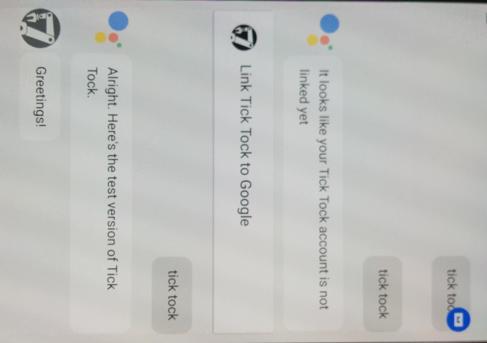

# Google Home

## storage_cors

The store_cors directory contains utilities to set the google cloud storage CORS settings. CORS (Cross-Origin Resource Sharing) must be configured to allow local development of cellbots apps. To set the CORS, download the tools from https://cloud.google.com/storage/docs/gsutil_install, and then run set_cors.sh. The settings are stored in cors.json.

## functions and rules

The cloud functions are used to manipulate functions in the firebase cloud, and are stored in the "functions" directory. The rules are security rules for access, and are written into the "firebase.json" file. To deploy the rules and functions, run:
```
cd functions
npm install
cd ..
firebase deploy
```

After you have completed the `npm install`, you do not need to run it again, you can only run `firebase deploy`. You can also run `firebase deploy --only functions` or `firebase deploy --only database` to deploy just the functions or rules respectively.

## hacker

The hacker is a tool that attempts to compromise the database by running invalid commands. It simulates a malicious individual that managed to extract the firebase keys from the apps and then started writing their own client for our database. You can run the hacker by openning hacker.html and then viewing the javascript console.

## storage_rules.txt ##

Copy and paste of the storage rules from firebase console. TODO: automate deployment.

----

# How to use API.AI

## Introduction

The API.AI agent can be launched via an Android phone with Google Assistant or Google Home device. In both cases, it's necessary to authenticate the user who is using it.

### Android phone with Google Assistant

I you try to use the cloud functions and you don't recieve and response (like in the photo), you have to launch the test on [Actions on Google console](https://console.actions.google.com/project/cellbots-robot-app/simulatorcreate) and authenticate it.

Execute the agent on the simulator using `Talk to Tick Tock` and then execute the program, again, on the Android phone. 



You can execute it on two ways. One is using `Talk to Tick Tock`, and the other, just naming the agent name: `Tick Tock`.

### Google Home

Once you set up a Google Home with an existing Firebase user account, you can run it with the previous commands mentioned before.
The device will recognize your voice and should authenticate you to Firebase.

## Execution instructions

This instructions can be found on the [API.AI console](https://console.api.ai/).

## TODO

In order to improve the quality of this service, it's necessary to do some modifications:
- Check that the user only can read his own part of the database.
- Increase the feedback beetween the agent and the user.

## More information

To know more about this, a document has been created [here](https://docs.google.com/document/d/1dpuwNuULCJs4R0FzbTxl2MFTo9zRdU3ryf33nWMyPCQ/edit?usp=sharing).

Current supported voice commands: [here](https://docs.google.com/document/d/1188y3Tz2aYitMTWN2JWRiIDLF0ivZ67T-_ECjXjMFDo/edit?usp=sharing).

