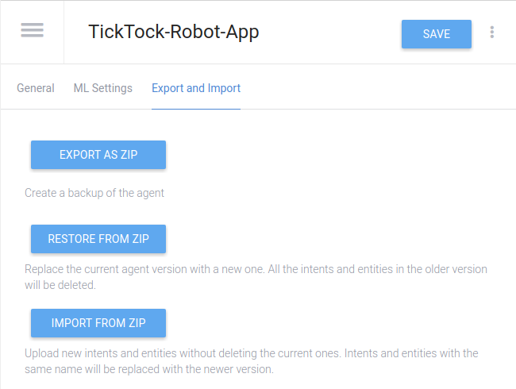

# Restoring the API.AI agent

In case of fails, the latest copy of the API.AI agent should be backed up here.
To restore it, you should go to the **Export and Import** tab in the project settings ([link](https://console.api.ai/api-client/#/editAgent/a51e9618-9256-4ce7-ad42-c99e69c799ef/)).

Then, click on **RESTORE FROM ZIP** and select one of the .zip files stored here.
That's all!

