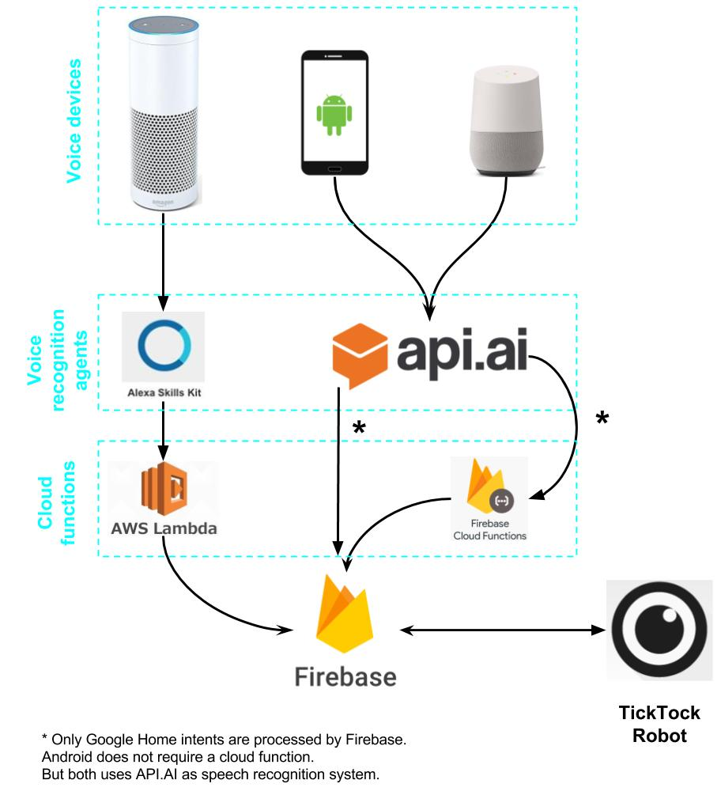

# Voice commands

## Overall structure of the project

The Cellbots robot can accept voice order via:
- Companion app
- Google Home (or any _Google Assistant_-enabled device, like Allo)
- Amazon Echo (or any other Amazon device with _Alexa_)

### Google Assistant

[API.AI](console.api.ai) is in charge of voice processing. It takes user voice commands and splits them in recognizable entities. Then, it recognize what action was said and sends the command to the robot (**NOTE: writing the goal in Firebase**), but previously, it needs to do some checks based on which device is used.

#### Companion app

This app already knows which robot has to be moved and also is connected to Firebase. So, the previously mentioned checks are made there.

#### Google Home

This device doesn't know which robot is being used by the user, so executes a Firebase Cloud Function which then writes the goal order into Firebase.

### Alexa

Any Alexa device uses [Alexa Skills Kit](https://developer.amazon.com/alexa-skills-kit) to recognize voice commands. Then, like with Google Home, a cloud function is triggered to do checks and write into Firebase.